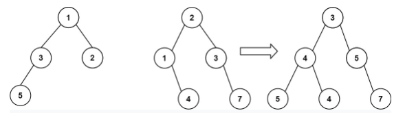

# problem
You are given two binary trees root1 and root2.

Imagine that when you put one of them to cover the other, some nodes of the two trees are overlapped while the others are not. You need to merge the two trees into a new binary tree. The merge rule is that if two nodes overlap, then sum node values up as the new value of the merged node. Otherwise, the NOT null node will be used as the node of the new tree.

Return the merged tree.

Note: The merging process must start from the root nodes of both trees.



Example 1:

```
Input: root1 = [1,3,2,5], root2 = [2,1,3,null,4,null,7]
Output: [3,4,5,5,4,null,7]
```

Example 2:

```
Input: root1 = [1], root2 = [1,2]
Output: [2,2]
 ```

Constraints:

```
The number of nodes in both trees is in the range [0, 2000].
-104 <= Node.val <= 104
```
# solution
```python
class Solution:
    def mergeTrees(self, root1: Optional[TreeNode], root2: Optional[TreeNode]) -> Optional[TreeNode]:
        # そもそもマージする元のtreesがない場合はreturnする物はない
        if not root1 and not root2:
            return None
        # root1というtreeがなければroot2がそのままマージ後のtree
        if not root1:
            return root2
        if not root2:
            return root1
        # ちゃんと二つのtreeをマージするケース
        if root1 and root2:
            # 新たなtreeを作成
            # rootノードはroot1と2の総和
            ans = TreeNode(root1.val + root2.val)
            # 新treeの左のツリーを作成
            ans.left = self.mergeTrees(root1.left,root2.left)
            # 新treeの右のツリーを作成
            ans.right = self.mergeTrees(root1.right,root2.right)
            # 作成した新規ツリーの各valueを返す
            return ans
```

再帰関数の最後のところで、root1と2のvalを足して、それを返して、一個上の層も合計してって感じ